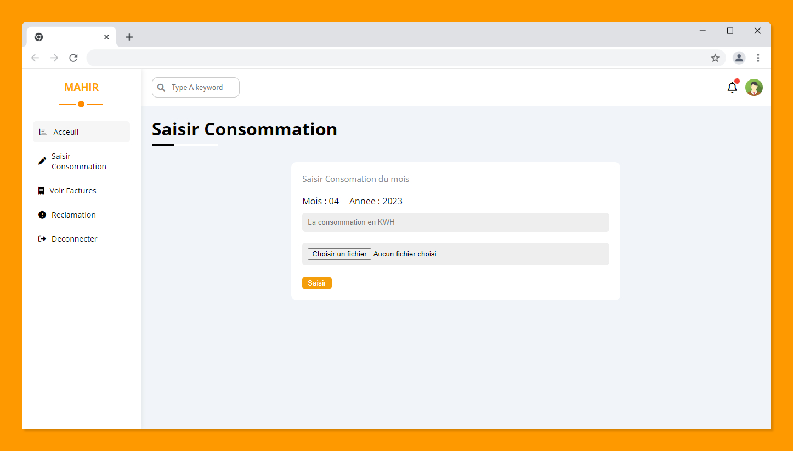

# Web application for generating electrical invoices
I have worked on an exciting project to develop a web application for generating electricity bills. This application allows customers to enter their monthly electricity consumption and upload a photo of their meter for accurate and transparent billing. Customers can also view their electricity bills and file a complaint.

The supplier can manage customers by adding and modifying their information, verifying customer electricity consumption information at the end of each year, and generating bills for each customer. Each bill contains customer information, electricity consumption, and price (excluding and including taxes), calculated based on the monthly unit price according to consumption. Customers are divided by geographical area, and each area is managed by an agent.

The project also includes a functionality to automate the insertion of each customer's annual consumption, which is submitted by agents in an annual consumption file.

Finally, the web application provides a dashboard to display summary information on the amount of unpaid bills, electricity consumption per month and per geographical area, and other statistics.

## Table of contents

- [Overview](#overview)
  - [Screenshot](#screenshots)
- [My process](#my-process)
  - [Built with](#built-with)
- [Author](#author)

## Overview

### Screenshots
#### Home page: 

#### Admin space :

#### Client space: 

#### Agent space: 

## My process

### Built with

- PHP8 
- MySql
- HTML5
- CSS3
- JavaScript 

## Author

- Website - [Mahir Rochdi](https://github.com/MAHIRROCHDI)
- Linkedin - [@rochdi-mahir](www.linkedin.com/in/rochdi-mahir)
