# Web application for generating electrical invoices
I developed a web app that generates electricity bills based on monthly consumption and uploaded photos. It also manages customer data, automates annual consumption, and provides a dashboard for statistics. Other features include a complaint filing system, geographical area management by agents, and pricing calculated based on monthly unit price.

## Table of contents

- [Overview](#overview)
  - [Screenshot](#screenshots)
- [My process](#my-process)
  - [Built with](#built-with)
- [Author](#author)

## Overview

### Screenshots
#### Admin space: 
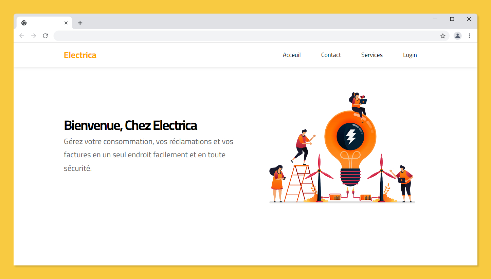
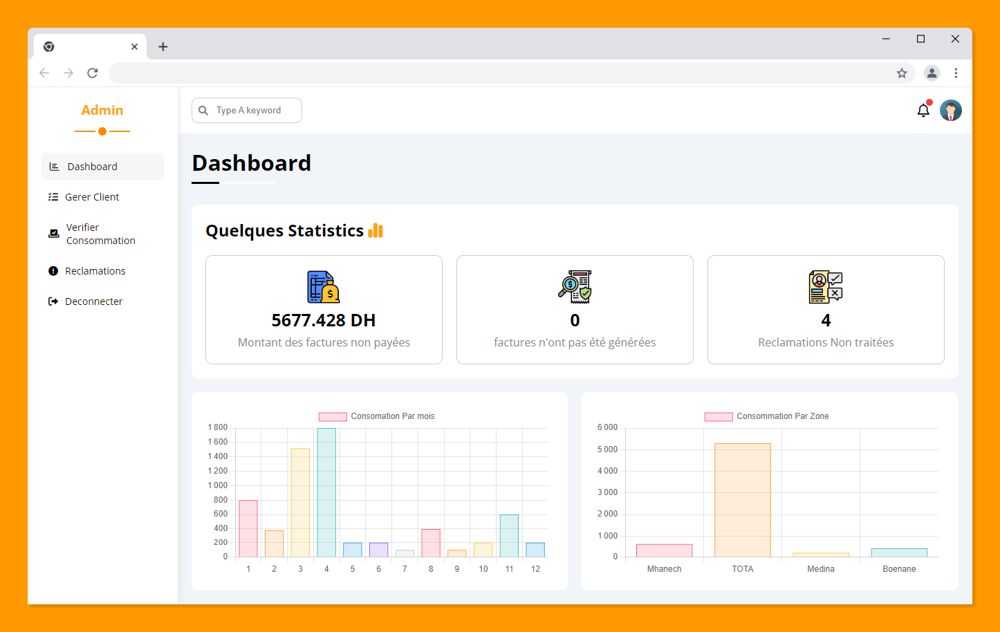
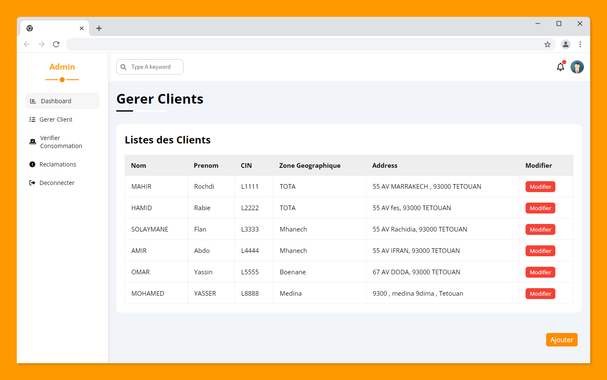
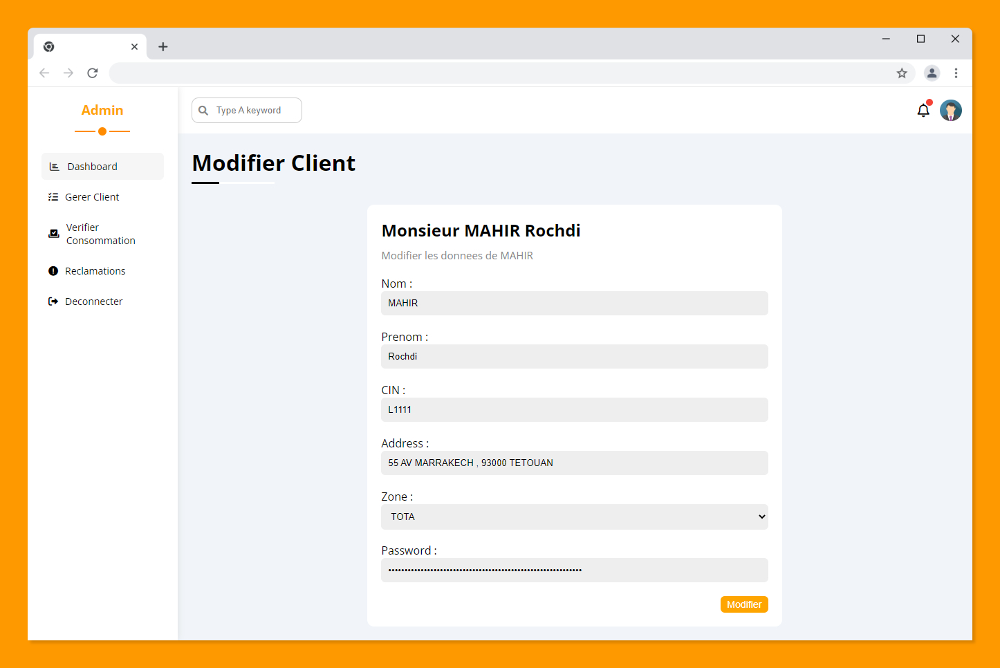
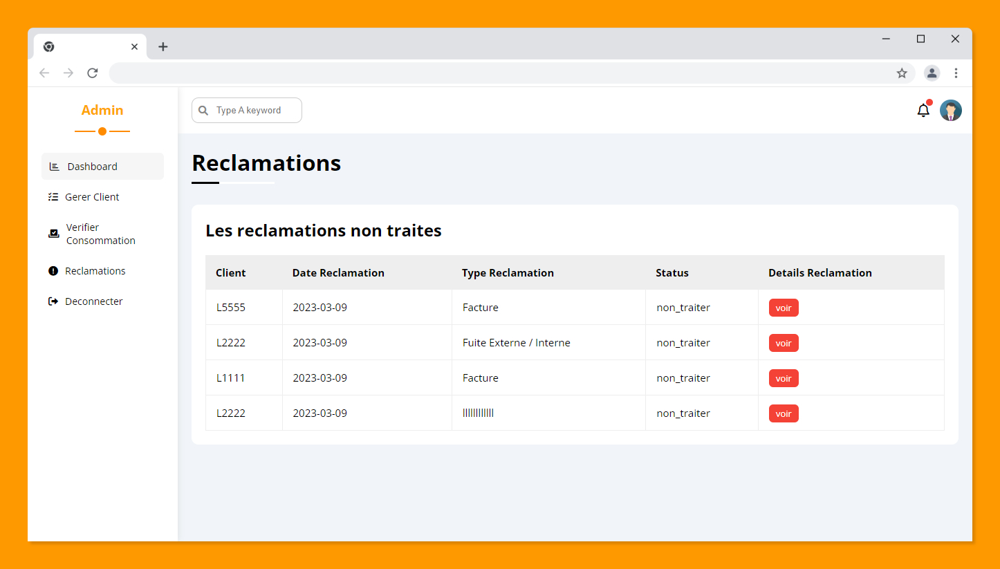
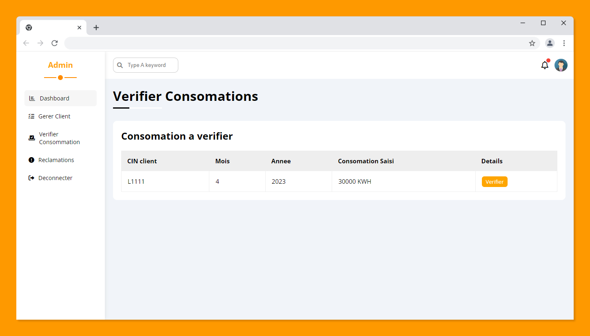
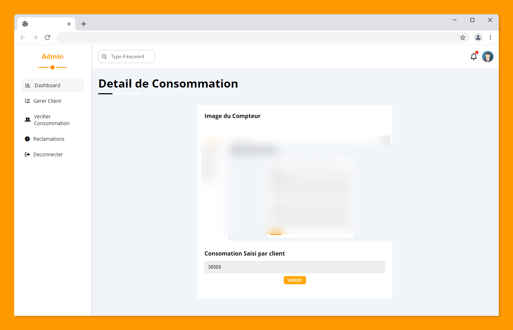
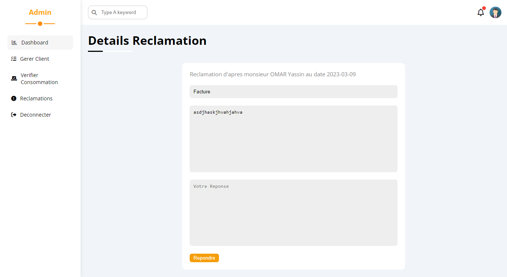
#### Client space: 
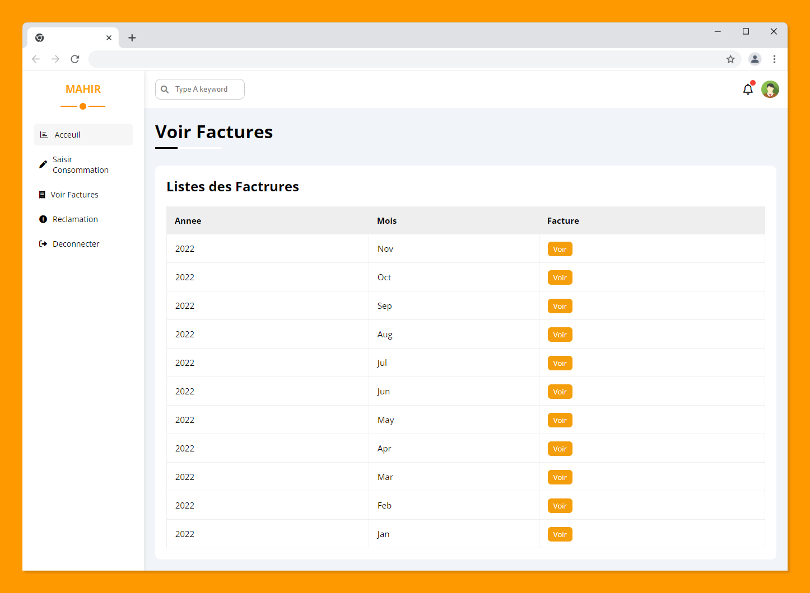
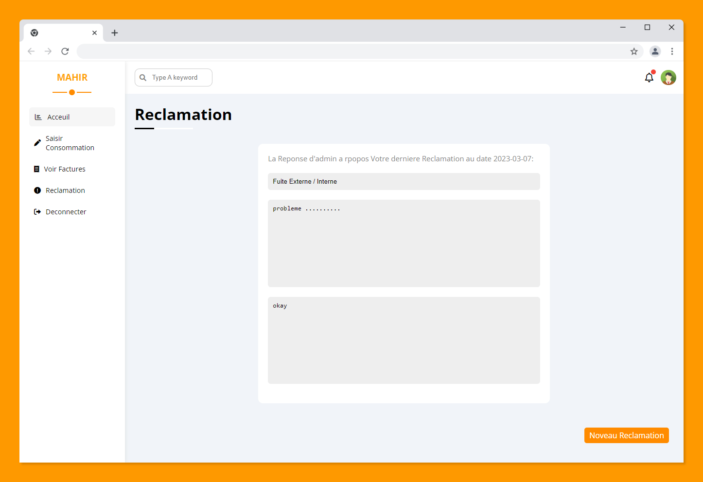

#### Agent space: 
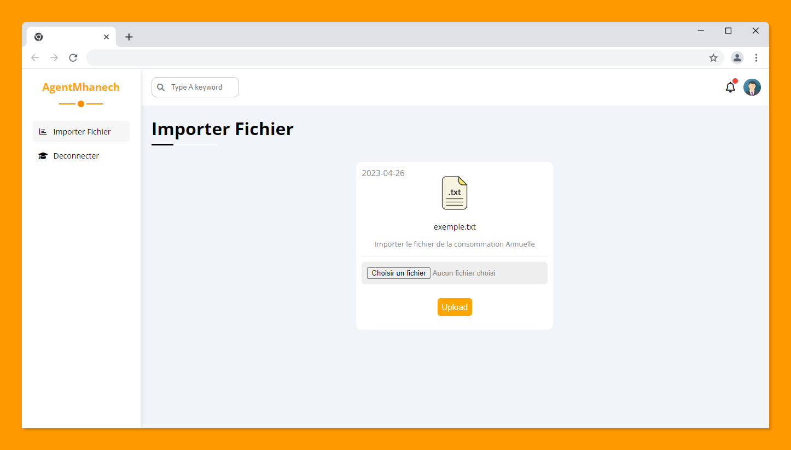

## My process

### Built with

- PHP8 
- MySql
- HTML5
- CSS3
- JavaScript 

## Author

- Website - [Mahir Rochdi](https://github.com/MAHIRROCHDI)
- Linkedin - [@rochdi-mahir](www.linkedin.com/in/rochdi-mahir)
